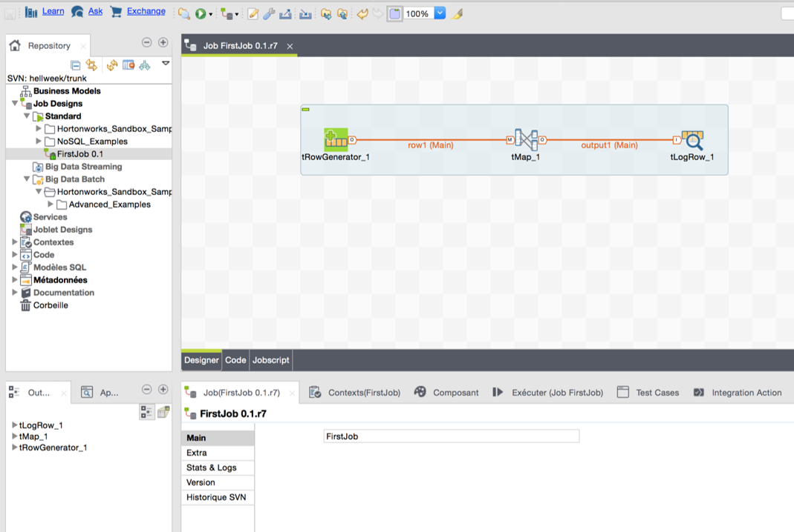

# Talend Studio

Talend Studio is a rich client that allows the user (such as a project manager, a developer or a DBA) to work on any Talend project for which he has authorization.

Talend Studio offers a comprehensive set of tools and functions for all its key capabilities including:

- Integration
- Activity monitoring Console

These tools are ALL accessible in different perspectives from one Studio

#### Key Features:
- Graphical Development
- Broadest Connectivity (900+ components)
- Real-time debugging
- Auto Documentation
- Shared Artifact Repository
- Monitoring of processes

#### Technical Implementation:
- Eclipse-based IDE 
- One IDE per licensed developer

#### Ideal Developer PC:
- 8gb+ RAM, SSD Hard Disk, Fast multi-core Processor, Real-time AV exemptions

#### Perspectives (license-controlled):
- Integration
- MDM
- BPM
- Profiling
- Mapping (Talend Data Mapper)
- Component Designer
- AMC
- Data Explorer
- Debug

Metadata is shared as appropriate between perspectives.

To read more about features of Talend Studio click [link][studio]

<!-- links -->
[studio]: https://help.talend.com/reader/fE51zt3EBkq3lp1Op6DPEw/iCHjC4bCsOZAf858mPIslg "Talend Data Fabric Studio User Guide"
