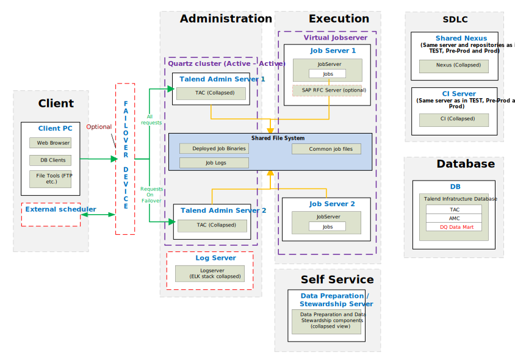
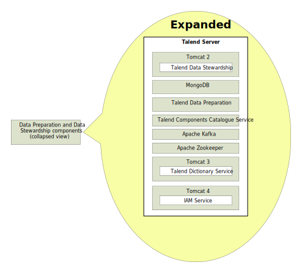

## Data Management – Physical Reference Architecture for Pre-Prod and Production

### Pre-Prod & Prod Environment

*Download a [Visio file][DM-Architecture-7.0-Prod] that contains this architecture diagram.*

### Data Preparation and Stewardship Expanded View

### Environment Highlights

- Servers shown per role per environment
- We will replicate the servers on the right for each environment
- No Nexus shown here because it is on our SDLC Server.
- Central Log Server is not shown here.
- Data Prep and Data Stewardship are not shown here.
- Failover device is generally Apache Httpd, VIP, or a Load Balancer.  However, not all Load Balancer are tested by Talend.  Hence, limitations will exist.

### Advanced Configurations
- **[Setting up High Availability][ha]**

- **[Using Virtual Job Servers][vjs]**

<!-- links -->
[DM-Architecture-7.0-Prod]: ./../../../../resources/visio/dm-architecture/data-management-physical-architecture-7.0.vsdx
[ha]: ./tac-ha-availability
[vjs]: ./virtual-job-servers
