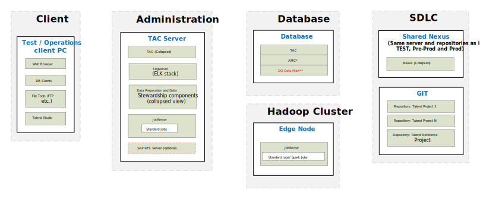
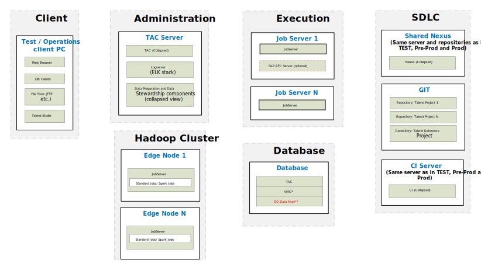

## Big Data – Physical Reference Architecture for Development

### Simple Development

*Download a [Visio file][BD-Architecture-6.4-dev-simple] that contains this architecture diagram.*

### Advanced Development

*Download a [Visio file][BD-Architecture-6.4-advanced] that contains this architecture diagram.*

### Environment Highlights

- Same as Data Management Platform Reference Architecture
- Servers shown per role
- Network connections and ports not shown here to keep the diagram simple enough to follow
- Optional components are shown as yellow dashed boxes
- One Nexus is shared across all environments.  This is the starting point.  The customer needs to justify why they need more than 1 Nexus across the whole deployment.
- JobServer deployed on Edge Nodes for Big Data Yarn Client processing.
- JobServers are installed seperate from TAC Servers in Advanced Configuration. 

<!-- links -->
[BD-Architecture-6.4-dev-simple]: ./../../../../resources/visio/big-data-architecture/big-data-physical-architecture-6.4.vsdx
[BD-Architecture-6.4-advanced]: ./../../../../resources/visio/big-data-architecture/big-data-physical-architecture-6.4.vsdx
