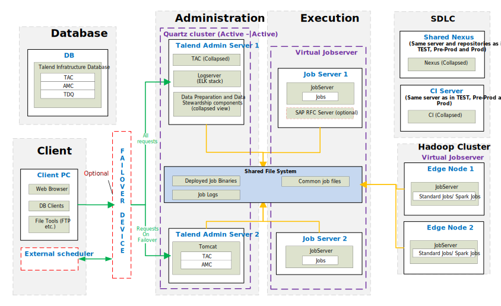

## Big Data – Physical Reference Architecture for Pre-Prod and Production

### Testing

*Download a [Visio file][BD-Architecture-6.4-prod] that contains this architecture diagram.*

### Environment Highlights

- Same as Data Management
- Added new Virtual Job Server for Big Data Edge Nodes hosting Job Server 

<!-- links -->
[BD-Architecture-6.4-prod]: ./../../../../resources/visio/big-data-architecture/big-data-physical-architecture-6.4.vsdx
