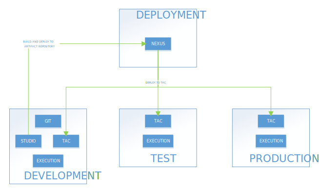

## Environments Deployment Strategy

### Simple

*Download a [Visio file][vd-DI-6.4-prod-Simple] that contains this architecture diagram.*

### Advanced

*Download a [Visio file][vd-DI-6.4-prod-Advanced] that contains this architecture diagram.*

### Highlights
- The GIT in the SDLC server is only accessible from the Development Environment.  Other environments cannot access GIT.
- Only Nexus Releases and Snapshots repositories are accessible to TEST and PRE-PROD environments.
- Only Releases repository is accessible from PROD environment.
- Nexus access can be controlled by user privileges and firewall/proxy.
- Continous Integration can be setup if going with Advanced setup

<!-- links -->
[vd-DI-6.4-prod-Simple]: ./../../../../resources/visio/di-architecture/data-integration-deployment-architecture-6.4.vsdx
[vd-DI-6.4-prod-Advanced]: ./../../../../resources/visio/di-architecture/data-integration-deployment-architecture-6.4.vsdx
