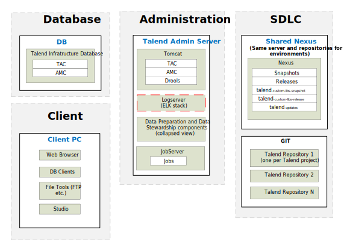
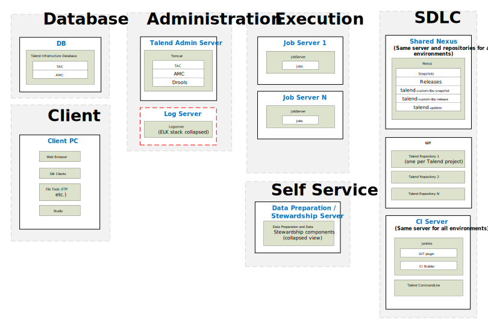

## Typical Physical Architecture

### DI - Simple Development Architecture:

*Download a [Visio file][vd-DI-6.4-dev-Simple] that contains this architecture diagram.*

### DI - Advanced Development Architecture

*Download a [Visio file][vd-DI-6.4-dev-Advanced] that contains this architecture diagram.*

### Environment Highlights
- Servers show per role
- Network connections and ports not shown here to keep the diagram simple enough to follow
- Optional components are shown as yellow dashed boxes
- One Nexus is shared across all environments.  This is the starting point.  The customer needs to justify why they need more than 1 Nexus across the whole deployment.
- GIT is only needed in the development environment and not accessed from other environments.

<!-- links -->
[vd-DI-6.4-dev-Simple]: ./../../../../resources/visio/di-architecture/data-integration-physical-architecture-6.4.vsdx
[vd-DI-6.4-dev-Advanced]: ./../../../../resources/visio/di-architecture/data-integration-physical-architecture-6.4.vsdx
