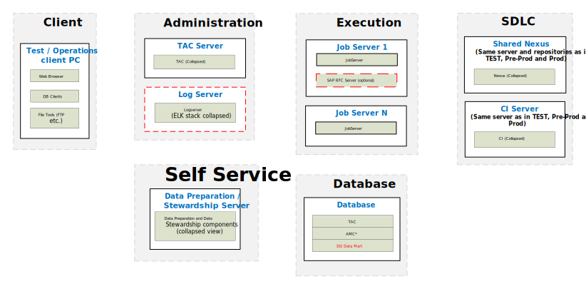

## Data Management – Physical Reference Architecture for Testing

### TEST Environment

*Download a [Visio file][DM-Architecture-6.4-Test] that contains this architecture diagram.*

### Environment Highlights

- Servers shown per role per environment
- We will replicate the servers on the right for each environment
- Optional components are shown as yellow dashed boxes
- No Nexus shown here because it is on our SDLC Server.

<!-- links -->
[DM-Architecture-6.4-Test]: ./../../../../resources/visio/dm-architecture/data-management-physical-architecture-6.4.vsdx
