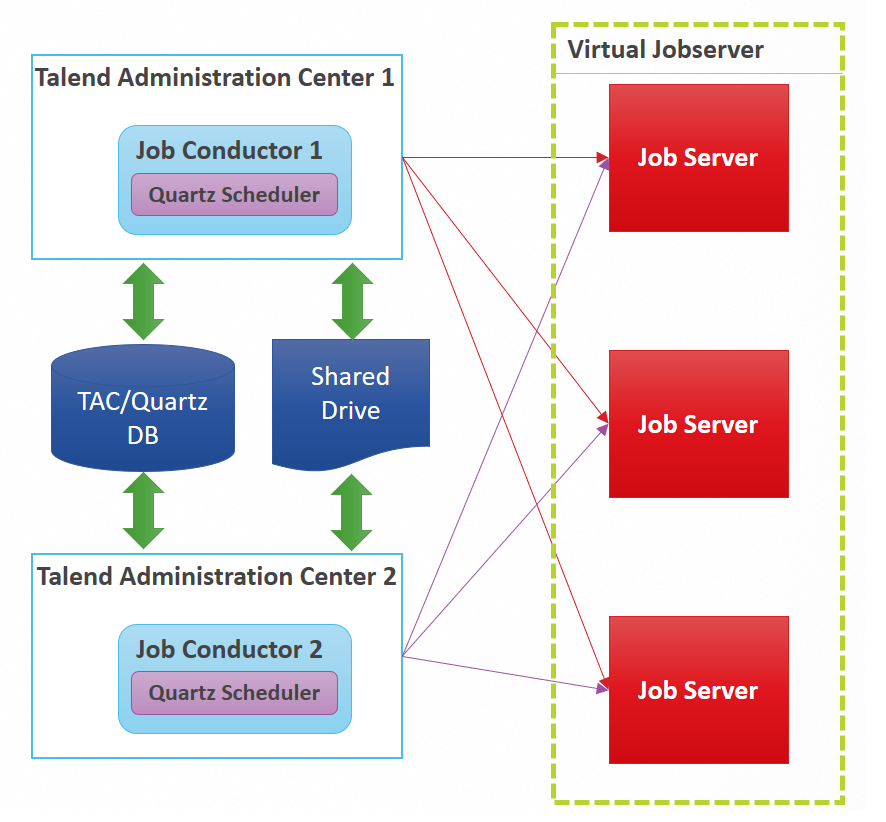

## Virtual Job Servers

### Purpose
- Execution Server HA and load balancing
- Best suited server will be selected for execution at triggering time of jobs.  
- TAC monitors health of each Job Server (RAM, Disk, CPU) to determined best suited at trigger time
- Jobs are deployed to all JobServers in the 

### Pre-requisites
Talend Platform Product (Not available in Talend Data Integration)

### Configuration
- Follow instructions in <a href="https://help.talend.com/reader/uwwCVAHxWDS6l5fZQ~lVYA/0_bjiNBtHiwL_XMhgd9UuQ" target="_blank">Talend Help documentation</a>
- Job Server configuration and logs are local to each Job Server
- Both TACs will contain virtual server group configuration (since TAC DB is shared)
- Resources used by jobs should be placed on shared network drive e.g.:
    Parameter (context) files
    Trigger files
    Source files

### Constraints/Limitations
- Tasks on automatic schedule will start from the beginning
- No dependencies across Job Servers
- No HA configuration at Job Servers level

<!-- links -->