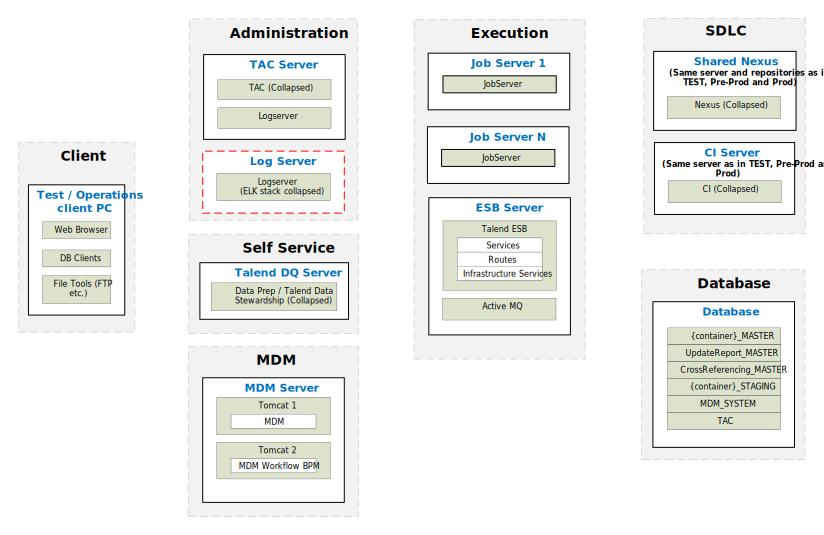

## Typical Physical Architecture (MDM - TEST Advanced)

### TEST Environment

*Download a [Visio file][MDM-Architecture-6.4-test] that contains this architecture diagram.*

### Environment Highlights

- Servers shown per role per environment
- We will replicate the servers on the right for each environment
- Optional components are shown as yellow dashed boxes
- No Nexus shown here because it is on our SDLC Server.

<!-- links -->
[MDM-Architecture-6.4-test]: ./../../../../resources/visio/mdm-architecture/mdm-physical-architecture-6.4.vsdx
