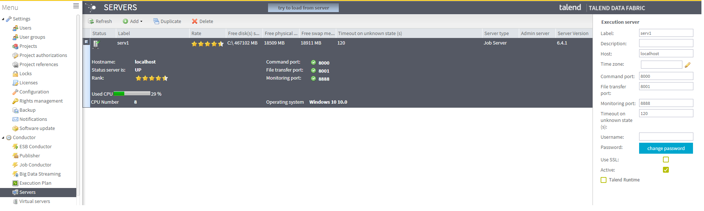

## JobServer

The JobServer  represents the lightweight agents  that run technical processes according to the execution scheduling set up in the Talend Administration Center Web application. They can be generally used in conjunction with the TAC Job Conductor and can also be used by Talend Studio for Distant Run functionality. The Job servers can be of One or more deployed inside your information system that run technical processes (Jobs) according to scheduled time, date or event set in the Talend Administration Center Web application.

### Technical Details
- Server Component
- Run as a Service / Daemon
- No license restrictions on number of Job Servers that can be installed (except specific contracts with Mission Critical Support)
- Can leverage SSL for securing communication
- Monitor server health (CPU, RAM, DISK usage)

To read and understand more on working with JobServers please read <a href="https://help.talend.com/reader/uwwCVAHxWDS6l5fZQ~lVYA/WQEE9V~JEXEursWsVzQysQ" target="_blank">Talend Help documentation</a> 

<!-- links -->
