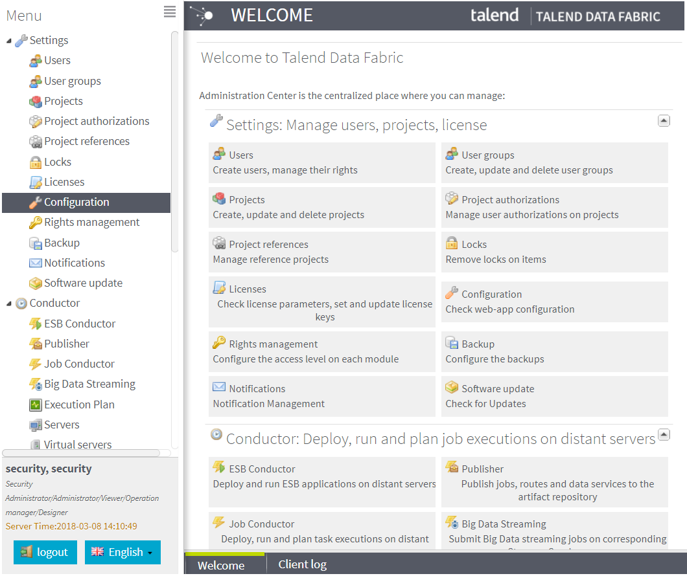

## Talend Administration Center (TAC)

The Talend solutions offer the opportunity to work cooperatively on various projects: Data Integration, ESB, Data Management, Data Services, Enterprise Integration, MDM, or all of them.

This collaborative work is handled via Talend Administration Center, a web-based application centralizing the management and administration of your studio. Talend Administration Center also centralizes the users' role management and access rights to your projects and the scheduling and monitoring of processes(Jobs).

Projects and processes are all centralized in a remote repository enabling resource sharing and project configuration.

Users created via Talend Administration Center will be able to connect to the projects they have been assigned to in the studio, where they will be able to create technical processes that would then be made available via Talend Administration Center for remote launching, scheduling and monitoring. 

Talend Administration Center allows you to:

- Manage operating and connection information via the Configuration page of the application for Environment Configuration. 
- Administrate projects, manage users and licenses via the Projects, Users and Licenses pages. 
- Schedule deployment and roll-out of processes (Jobs) via the Conductor node and monitor them via the Monitoring node.
- Recovery & Restart of Tasks
- Provides the ‘MetaServlet’ – A REST API and wrapper scripts for task automation

### Technical Details
- Server Component
- Web application – access via browser – supported browsers in documentation
- One per Talend ‘Environment’
- Hosted on Tomcat (v8 embedded by default - recommended), JBoss or WebSphere /WebLogic
- Child applications – AMC web app, Drools Guvnor (KIE-workbench)
- Generally deployed as a Service / Daemon
- Can be SSL secured if required

### TAC Database

Helps Maintain Admin Metadata (users, project definition, authorization, scheduler tasks, configuration, etc.) and Accessed solely by TAC.

Technical Details of TAC DB :
- Server Component
- Small database with low volume of data (generally < 1GB)
- Database Supported – all common relational databases – see product documentation

To read & understand more Talend Administration Center User Guide can be found in <a href="https://help.talend.com/reader/uwwCVAHxWDS6l5fZQ~lVYA/MDauhq9nl1m0FXZX~aHp9Q" target="_blank">Talend Help documentation</a> 

<!-- links -->

