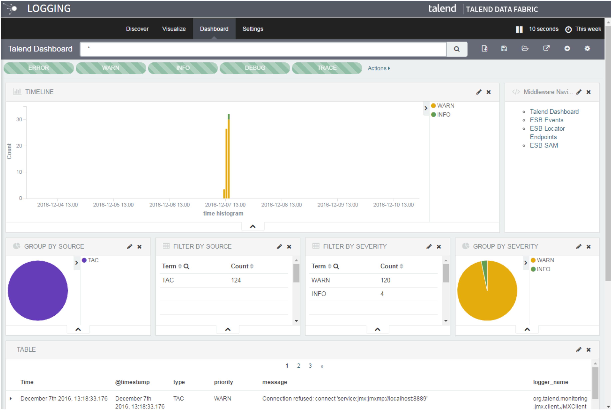

# Talend Log Server

The Talend Log Server is a logging engine based on Elasticsearch which is developed alongside a data-collection and log-parsing engine called Logstash, and an analytics and visualization platform called Kibana.
It is used to streamline the capture and storage of logs from Talend Administration Center, MDM Server, ESB Server and Tasks running through the Job Conductor.It is tool for managing events and Job logs. Generally used when a Talend customer does not have an enterprise monitoring solution.
Key Features:
- **Horizontally Scalable**: Elasticsearch is distributed by nature: it knows how to manage multiple nodes to provide scale and high availability. This also means that your application doesn’t need to care about it.
- **Near Realtime Search**: It is used for full-text search, structured search, analytics and all three in combination. It allows you to store, search, and analyze big volumes of data quickly and in near real time
- **Data Aggregation**: Using Logstash dynamically unify data from disparate sources and normalize the data into destinations of your choice.
- **Analytics and Visualization**: Kibana makes it easy to understand large volumes of data. Its simple, browser-based interface enables you to quickly create and share dynamic dashboards that display changes to Elasticsearch queries in real time. 

The Web-based Logging page in Talend Administration Center is based on Kibana 3 (with Elasticsearch).

### Technical Details
- The Talend Log Server is optional when it is installed, the log data - even large amounts of log data - can be searched much more quickly and easily.
- Run as a Service / Daemon usually on same server as TAC but in production environments we recommend it to be independent servers.
- Can be secured / clustered, but only OOTB configuration is supported by Talend.

To understand configuring Talend logging modules with an external Elastic stack please click <a href="https://help.talend.com/reader/vuI_X~V6unFjTgNxRMPcLw/Bha0T_WyR_U4ZkVXo2F1Dg" target="_blank">Talend Help documentation</a> 

<!-- links -->
