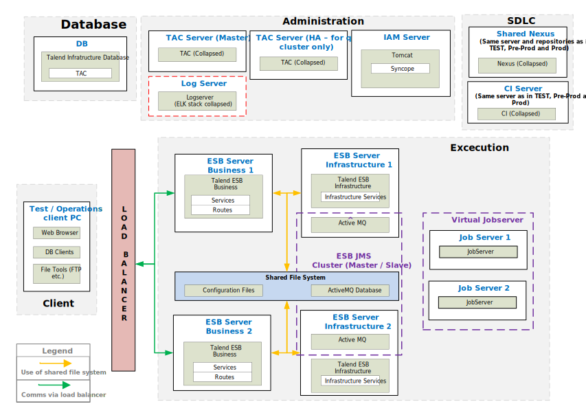

## ESB – Physical Reference Architecture for Pre-Prod and Production

### Pre-Prod & Prod Environment

*Download a [Visio file][ESB-Architecture-7.0-prod] that contains this architecture diagram.*

### Environment Highlights

- Servers shown per role per environment
- We will replicate the servers on the right for each environment
- No Nexus shown here because it is on our SDLC Server.
- Central Log Server is not shown here.

<!-- links -->
[ESB-Architecture-7.0-prod]: ./../../../../resources/visio/esb-architecture/esb-physical-architecture-7.0.vsdx
