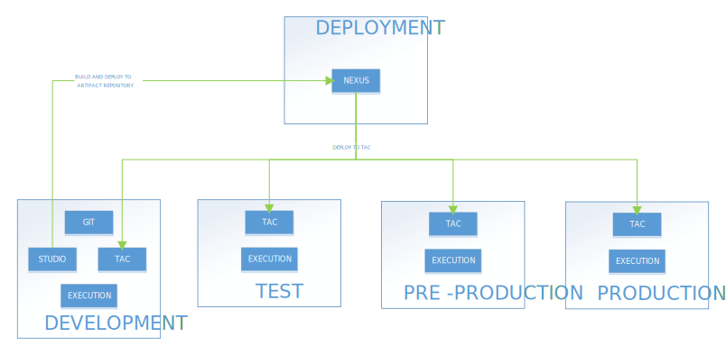
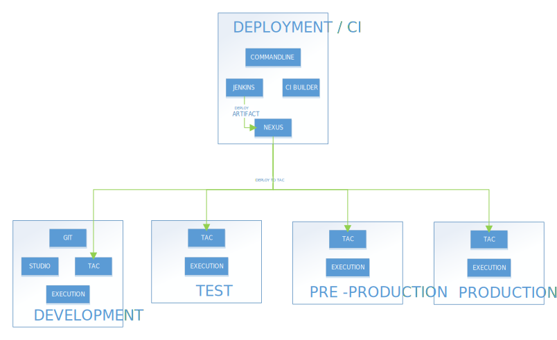

## Data Management – Deployment Strategy

### Simple:

*Download a [Visio file][deployment-dm-simple] that contains this architecture diagram.*

### Environment Highlights

- The GIT in the SDLC server is only accessible from the Development Environment.  Other environments cannot access GIT.
- Only Nexus Releases and Snapshots repositories are accessible to TEST and PRE-PROD environments.
- Only Releases repository is accessible from PROD environment.
- Nexus access can be controlled by user privileges and firewall/proxy.

### Advanced

*Download a [Visio file][deployment-dm-advanced] that contains this architecture diagram.*

### Environment Highlights

- The GIT in the SDLC server is only accessible from the Development Environment.  Other environments cannot access GIT.
- Only Nexus Releases and Snapshots repositories are accessible to TEST and PRE-PROD environments.
- Only Releases repository is accessible from PROD environment.
- Nexus access can be controlled by user privileges and firewall/proxy.
- Jenkins, Commandline, CI Builder and Nexus part of same server. 

<!-- links -->
[deployment-dm-simple]: ./../../../../resources/visio/dm-architecture/data-management-deployment-architecture-7.0.vsdx
[deployment-dm-advanced]: ./../../../../resources/visio/dm-architecture/data-management-deployment-architecture-7.0.vsdx
