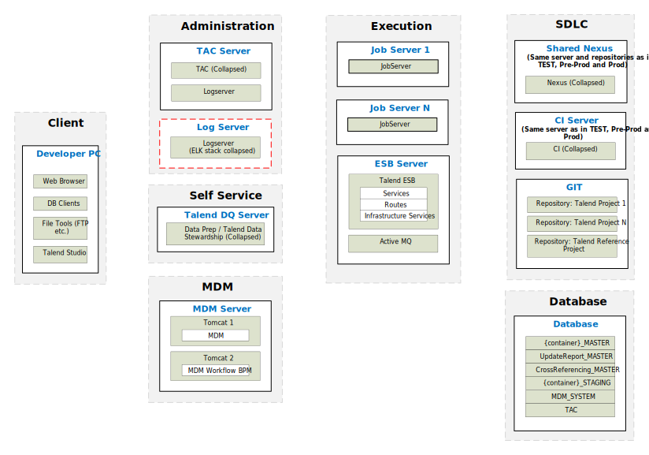

## Typical Physical Architecture (MDM - DEV Advanced)

### Development

*Download a [Visio file][MDM-Architecture-7.0-dev] that contains this architecture diagram.*

### Environment Highlights

- Servers shown per role
- Network connections and ports not shown here to keep the diagram simple enough to follow
- Optional components are shown as yellow dashed boxes
- One Nexus is shared across all environments.  This is the starting point.  The customer needs to justify why they need more than 1 Nexus across the whole deployment.

<!-- links -->
[MDM-Architecture-7.0-dev]: ./../../../../resources/visio/mdm-architecture/mdm-physical-architecture-7.0.vsdx
