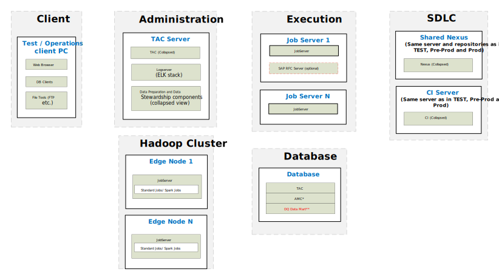

## Big Data – Physical Reference Architecture for Testing

### Testing

*Download a [Visio file][BD-Architecture-6.5-test] that contains this architecture diagram.*

### Environment Highlights

- Same as Data Management Platform Reference Architecture
- Servers shown per role 
- Network connections and ports not shown here to keep the diagram simple enough to follow
- Optional components are shown as yellow dashed boxes
- JobServer deployed on Edge Nodes for Big Data Yarn Client processing.
- Optional components are shown as yellow dashed boxes
- No Nexus shown here because it is on our SDLC Server show in the previous DEV Physical Architecture

<!-- links -->
[BD-Architecture-6.5-test]: ./../../../../resources/visio/big-data-architecture/big-data-physical-architecture-6.5.vsdx
