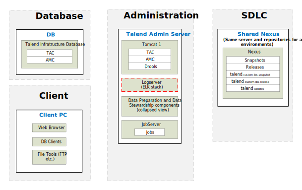
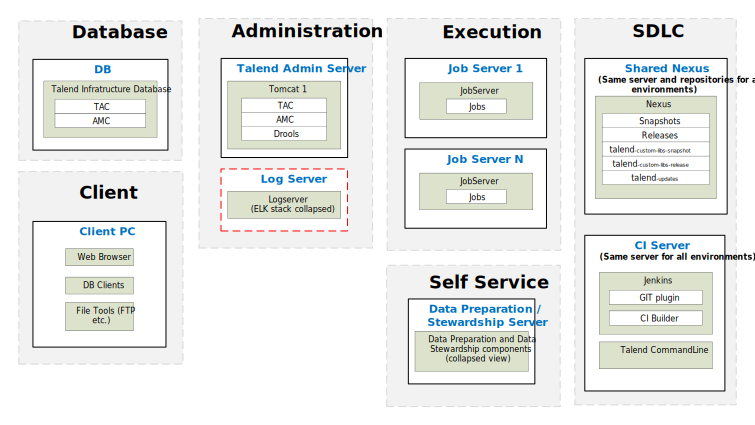

## QA, UAT & Production Environment

### Simple

*Download a [Visio file][vd-DI-6.5-prod-Simple] that contains this architecture diagram.*

### Advanced

*Download a [Visio file][vd-DI-6.5-prod-Advanced] that contains this architecture diagram.*

### Environment Highlights
- Servers shown per role per environment
- We will replicate the servers on the right for each environment
- Optional components are shown as yellow dashed boxes
- One Nexus is shared across all environments.  This is the starting point.  The customer needs to justify why they need more than 1 Nexus across the whole deployment.
- No GIT is shown here because it is not required in TEST,Pre-Prod and Production Environments
- Data Preparation and Data Stewardship are only going to be installed if customer wants them on-premise.

<!-- links -->
[vd-DI-6.5-prod-Simple]: ./../../../../resources/visio/di-architecture/data-integration-physical-architecture-6.5.vsdx
[vd-DI-6.5-prod-Advanced]: ./../../../../resources/visio/di-architecture/data-integration-physical-architecture-6.5.vsdx
