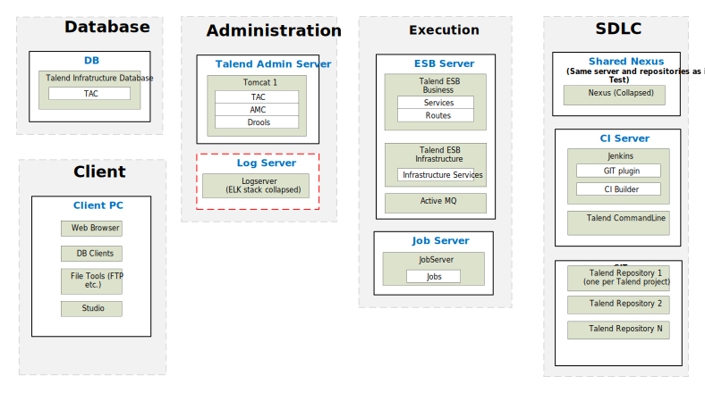

## ESB – Physical Reference Architecture for Development

### Development

*Download a [Visio file][ESB-Architecture-6.5-dev] that contains this architecture diagram.*

### Environment Highlights

- Servers shown per role
- Network connections and ports not shown here to keep the diagram simple enough to follow
- Optional components are shown as yellow dashed boxes
- One Nexus is shared across all environments.  This is the starting point.  The customer needs to justify why they need more than 1 Nexus across the whole deployment.

<!-- links -->
[ESB-Architecture-6.5-dev]: ./../../../../resources/visio/esb-architecture/esb-physical-architecture-6.5.vsdx
