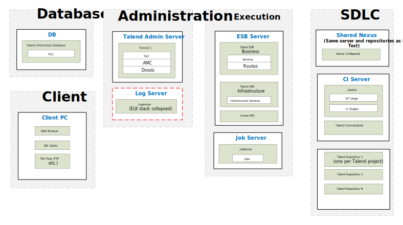

## ESB – Physical Reference Architecture for Testing

### TEST Environment

*Download a [Visio file][ESB-Architecture-6.5-test] that contains this architecture diagram.*

### Environment Highlights

- Servers shown per role per environment
- We will replicate the servers on the right for each environment
- Optional components are shown as yellow dashed boxes
- No Nexus shown here because it is on our SDLC Server.

<!-- links -->
[1]: ./../../../../resources/images/esb/esb-physical-architecture-test-advanced-6.5.svg "DM Architecture 6.5 for Testing"
[ESB-Architecture-6.5-test]: ./../../../../resources/visio/esb-architecture/esb-physical-architecture-6.5.vsdx
