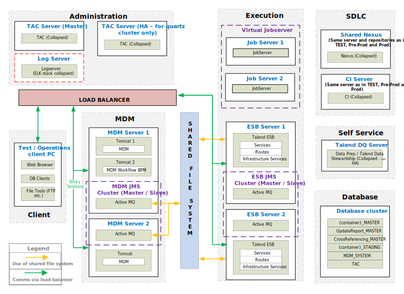

## MDM: PRE-PROD / PROD Advanced

### Pre-Prod & Prod Environment

*Download a [Visio file][MDM-Architecture-6.5-prod] that contains this architecture diagram.*

### Environment Highlights

- Servers shown per role per environment
- We will replicate the servers on the right for each environment
- No Nexus shown here because it is on our SDLC Server.
- Central Log Server is not shown here.
- Data Prep and Data Stewardship are not shown here.

<!-- links -->
[MDM-Architecture-6.5-prod]: ./../../../../resources/visio/mdm-architecture/mdm-physical-architecture-6.5.vsdx
