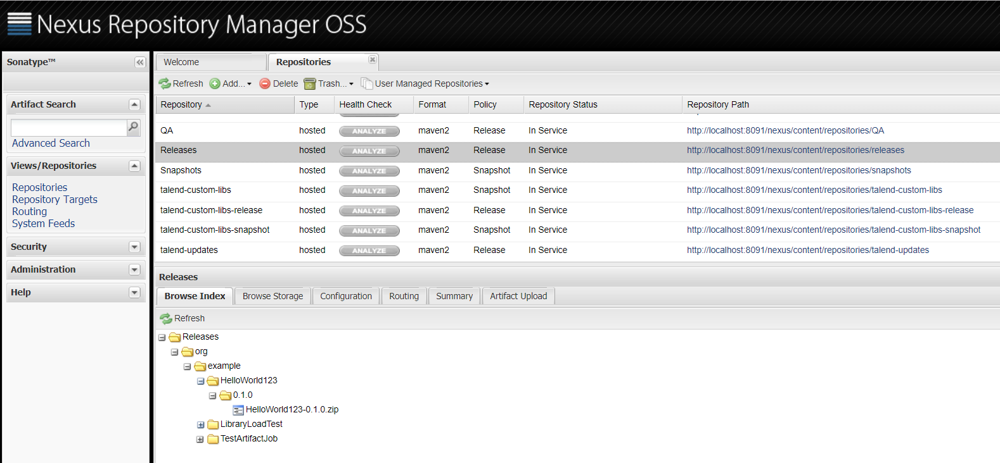

## Artifact Repository

The artifact repository delivered by Talend and based on Sonatype Nexus is a preconfigured application centralizing the management and usage of the Software Update, User libraries and snapshots and releases repositories:

- Software Update is used to manage application updates (patches) distributed by Talend. 
- The User libraries repository is used to store all external libraries. 
- The snapshots and releases repositories are used as a catalog in which all artifacts to be deployed and executed are stored. These artifacts are designed by the user from the Studio or any other Java IDE. By default, the snapshots repository is used for development purposes and the releases repository is used for production. These repositories make artifacts available for deployment and or execution in an execution server.

### Technical Details
- TAC defines the URL’s to the nexus repository for Studio
- It is a server component and runs as a service.
- It is a web application and is accessed via a web browser
- Generally, it is recommended to have just one instance which is used to deploy to all environments
- One instance of Nexus can manage several repositories. Talend uses five repositories in its default configuration  
- Only Nexus Releases and Snapshots repositories are accessible to TEST and PRE-PROD environments.
- Only Releases repository is accessible from PROD environment.
- Nexus access can be controlled by user privileges and firewall/proxy.
- Installed by the Installer or use your own – Only Sonatype Nexus 2.14 is supported. Nexus 3 will not work
- Critical for Talend development environment to function correctly!

To read in detail about Artifact repository please click <a href="https://help.talend.com/reader/QRjC9qwJQpy2ouFXbn639Q/aD4QYnAJUZyWqDylDFvcOQ" target="_blank">Talend Help documentation</a> 

To read more on Publishing into the Artifact repository please click <a href="https://help.talend.com/reader/93olCfmQi615MRwYBjy30g/sSh_6LAVLHtLJc5jL6e21Q" target="_blank">Talend Help documentation</a> 

<!-- links -->