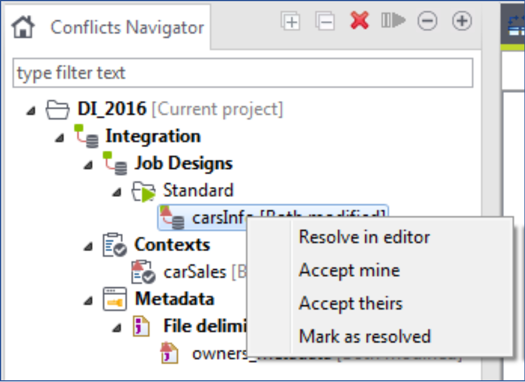
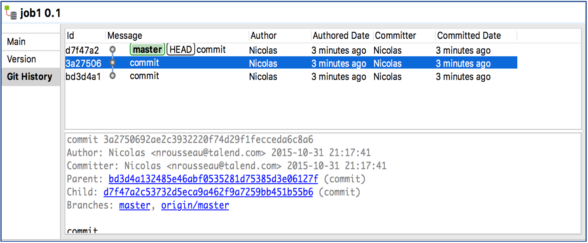
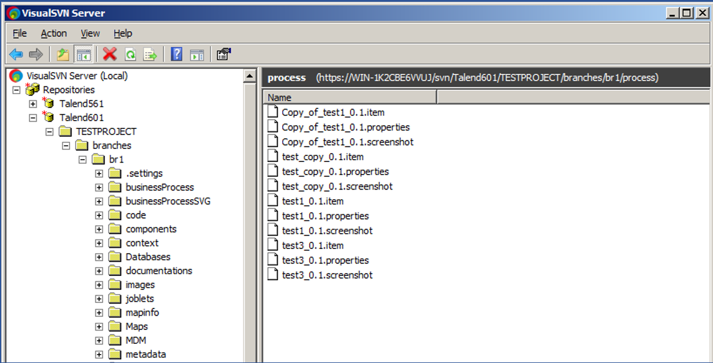
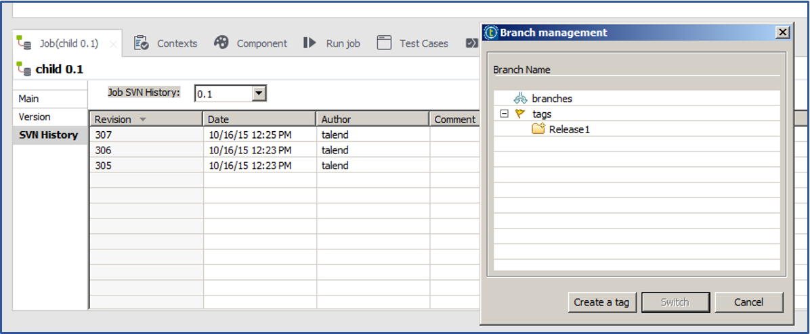

## Metadata Repository

The SVN or Git version control tools are used as repositories to centralize all project metadata like Jobs and Business Models shared between different end-users, and accessible from the Talend Studio to develop them and from Talend Administration Center to publish, deploy and monitor them. We recommend you to store several projects per repository, simply in order not to have too many repositories to deal with. However you can choose to store only one project per Git or SVN repository, if you prefer so.

## GIT
Git was added to Talend fromm  v6.1 and it follows the same workflow as SVN – no advanced GIT functions supported. From 
6.2 onwards provides a full GIT workflow (GIT local mode, GIT merge) – making it the preferred choice over SVN. Gitflow and Feature Branch workflows supported along with Tagging and branching as part of SDLC.

### Conflict

### Browsing

### Technical Details for GIT
- Server Component
- Common distributions and SaaS platforms supported -  see documentation
- GIT used in DEV Environment Only. 

## SVN
SVN can also be for Talend Project Metadata (Jobs, Connections, Schema Definitions etc. in XML & Properties files). It provides a versioning system for Talend objects / projects along with Tagging and branching as part of SDLC. It does NOT store binaries of Jobs nor support SVN Merge.

### Browse

### History

### Technical Details for SVN 
- Server Component
- Apache Subversion is a software versioning and revision control system
- Distributed as free software under the Apache License
- Common distributions supported – see documentation
- SVN 1.9 and 1.8 supported
- Used in Development Environment Only

To read and understand how to work collaboratively on project items please read <a href="https://help.talend.com/reader/UiLqXAv52hAS8fVDfvtn8w/JfFM8Tv192YedHKDKIRcpQ" target="_blank">Talend Help documentation</a> 

<!-- links -->

