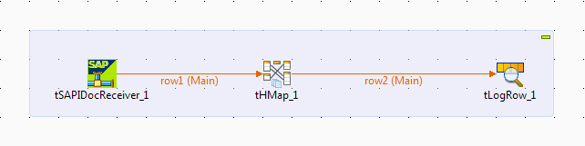

# Talend SAP RFC Server

![RFC][RFCImage]

Talend SAP RFC Server is a standalone server that acts as a gateway between Talend Studio and an SAP server. It receives IDoc documents from the SAP server and makes them available for processing in Talend Jobs.

- It utilises a JMS queue to collect IDoc documents.
- Talend Data Mapper can be used to parse the IDoc’s.

### Browsing IDoc Types

### Simple Job Flow

To see how to configure SAP to operate with the Talend SAP RFC Server please click <a href="https://help.talend.com/reader/rJXCeX3yTY2QMR96KbZOYA/vN3DTAB9E_PGTc4gJo3pXA" target="_blank">Talend Help documentation</a>  

<!-- links -->
[RFCImage]: https://help.talend.com/api/fluidtopicsclient/resources/YvsjhgVIvqyNiz1e5ajcJw/content "RFC Server Architecture"
{:.img-fluid}
